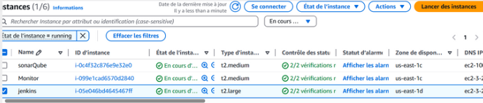
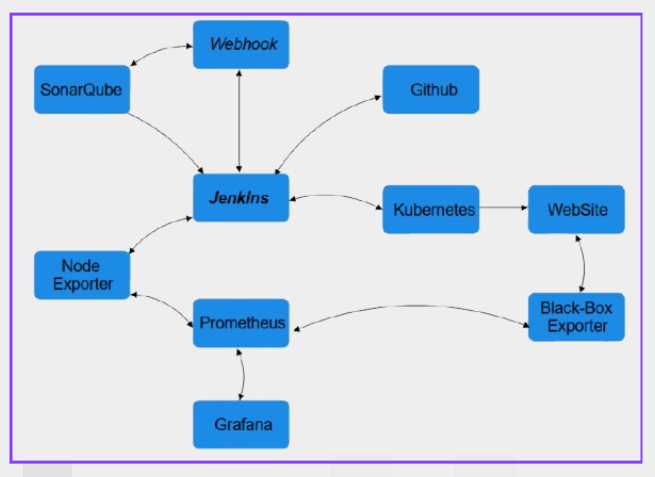

# Secure CI/CD Pipeline with Jenkins for Java Web App 🚀  

In my last academic project, I designed and implemented a secure CI/CD pipeline using Jenkins for a Java-based web application. This pipeline streamlines the deployment process while integrating robust security testing at every stage. Key tools include:

-SonarQube for static code quality analysis.

-Trivy for Software Composition Analysis (SCA) to scan open-source libraries and dependencies.

The pipeline generates detailed reports highlighting security findings, followed by a comprehensive monitoring phase at the application and system levels using Grafana and Prometheus.

This repository documents the entire process—from infrastructure setup to deployment—providing a clear, step-by-step guide. I hope you find it insightful!

## Project Architecture 📐  
*(Thumbnail of the architecture diagram will be added here)*  

  

---

## Infrastructure Setup  

### Step 1: Provisioning VMs  
To host the pipeline components, I launched **3 EC2 instances** on AWS:  
1. **Jenkins Server** (CI/CD orchestration)  
2. **SonarQube Server** (Static code analysis)  
3. **Monitoring Machine** (Logs/metrics)  
  
For Kubernetes, I used **Azure Kubernetes Service (AKS)** with one Master Node and Two Slaves, and loadbalancer service.  

   

---

## Jenkins Configuration  

### Step 2: Install & Set Up Jenkins  
Run these shell commands on your Jenkins server :  

```bash
# Update packages
sudo apt-get update

# Install Java 17+ (Jenkins dependency)
sudo apt install openjdk-17-jre-headless -y

# Add Jenkins repository key
curl -fsSL https://pkg.jenkins.io/debian-stable/jenkins.io.key | sudo tee \
  /usr/share/keyrings/jenkins-keyring.asc > /dev/null

# Add Jenkins repo
echo deb [signed-by=/usr/share/keyrings/jenkins-keyring.asc] \
  https://pkg.jenkins.io/debian-stable binary/ | sudo tee \
  /etc/apt/sources.list.d/jenkins.list > /dev/null

# Install Jenkins
sudo apt-get update
sudo apt-get install jenkins -y

# Start Jenkins
sudo systemctl start jenkins
sudo systemctl enable jenkins (this will start Jenkins anytime we run the virtual machine)
```
### Install Docker  

```bash
#!/bin/bash

# Update package manager repositories
sudo apt-get update

# Install necessary dependencies
sudo apt-get install -y ca-certificates curl

# Create directory for Docker GPG key
sudo install -m 0755 -d /etc/apt/keyrings

# Download Docker's GPG key
sudo curl -fsSL https://download.docker.com/linux/ubuntu/gpg -o /etc/apt/keyrings/docker.asc

# Ensure proper permissions for the key
sudo chmod a+r /etc/apt/keyrings/docker.asc

# Add Docker repository to Apt sources
echo "deb [arch=$(dpkg --print-architecture) signed-by=/etc/apt/keyrings/docker.asc] https://download.docker.com/linux/ubuntu \
$(. /etc/os-release && echo "$VERSION_CODENAME") stable" | \
sudo tee /etc/apt/sources.list.d/docker.list > /dev/null

# Update package manager repositories
sudo apt-get update

sudo apt-get install -y docker-ce docker-ce-cli containerd.io docker-buildx-plugin docker-compose-plugin 
```
## SonarQube configuration
### step 3:install and set up SonarQube

we need to install docker, so copy the same shell code for jenkins section inside a file.sh and then run it (don't forget chmod +x file.sh)

#### create a sonarqube container
```bash
docker run -d --name sonar -p 9000:9000 sonarqube:lts-community
```

this will run a sonarqube container in port 9000

## Kubernetes Configuration 
### step 4:Create a kubernetes server
you have your own choice if you choose a complete kuberntes service from aws or azure that already have every thing installed and ready or you can create your own kuberenetes server in EC2 VM, for me i've choosed the azure kuberenets service since i have a student account.
## Jenkins Pipeline(groovy syntax)
### step 5: building the pipeline :
we need to install some plugins befor we start building the pipeline
at least we need to install those plugins:  

-Eclipse Temurin Installer  

-Pipeline Maven Integration  

-SonarQube Scanner  

-Kuberenetes CLI  

-Kuberentes  

-Docker  

-Docker Pipeline Step  


we need to configure the credentials settings also( used to link the multiple services together) :


then,configure the system and tools parametres.

for the **Jenkins pipeline** you can find it attached above with the docker file and the deployement-file.

finaly, building the pipeline as you can see it's successfully builded !!


and this is the Public IP address provided by Kubernetes to access the webapp.


## Monitoring phase
### Step 5 : website level monitoring :
at this level we'll monitor the website traffic and state using Black-box exporter to gather metrics, Prometheus to store and manage the metrics and Grafana to showcase the result using a user friendly dashboard.
these are the links that help me to Download and setup the environement :
- Download Prometheus and Black-box eporter: https://prometheus.io/download/
- Download Grafana: https://grafana.com/grafana/download
- Help me in the yaml file configurations: https://github.com/prometheus/blackbox_exporter
  
This is the result, Grafana dashboard indicates multiple information about the Webapp like if its up or down, HTTP status...

### step 6 : System level monitoring :
at this level we used Node exporter for metrics collection from Jenkins server.
-Download Node exporter:  https://prometheus.io/download/  

This is the results, multiplr stats about CPU usage, RAM usage...(we can configure what we want to monitor using jenkins settings).

## Obtained Results
### Static Tests Results using SonarQube:

### Trivy generates detailed vulnerability reports for both the Docker image and open-source dependencies, ensuring comprehensive security analysis across the deployment stack.  

### Docker image report :  


### Libraries and Dependencies Report:  


### RECAP 
below an architucture diagram that explains how the multiple services in the infrastructure are linked and communicate: 

### Future Enhancement
-publishing the multiple builded artifact version into Nexus reposetory befor build the docker image  
-implementing a SIEM technologies for runtime monitoring  
-showcase Trivy's reports using a dashboard instead of HTML based Table
